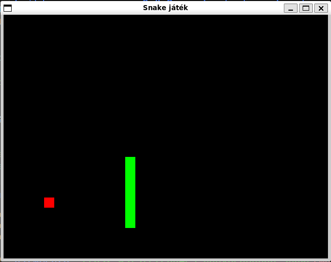

# `e0u4e3_nagybeadando_snake` package
# Útmutató a játék működéséről, alap szabályokról röviden.
Ez a program egy klasszikus Snake játék, amelyet C++ és SDL2 segítségével készítettem.
A játék egy ablakos felületen jelenik meg, a kígyó nyilakkal vezérelhető, és célja az, hogy minél több almát egyen meg, miközben elkerüli az ütközést önmagával és a falakkal.
Ez a projekt kiváló belépő szintű játékfejlesztési gyakorlat SDL2-ben, és jól szemlélteti az eseménykezelést, renderelést, és a játékmenet frissítését.

A játék SDL_Window és SDL_Renderer segítségével rajzol grafikát.
A kígyó és az alma egyszerű négyzetekből állnak, fix rácsméret (20x20 px) alapján.
A kígyó egy std::vector<Point> listában tárolódik.

Minden időlépésnél (100ms-onként):
  -A kígyó feje előre mozog.
  -Ha megeszi az almát → új alma, hosszabb lesz.
  -Ha nekiütközik magának vagy a falnak → vége a játéknak.

SDL eseménykezelő (SDL_PollEvent) figyeli a SDL_KEYDOWN eseményeket.
Az irány nem fordulhat 180 fokkal vissza, így nem lehet pl. fentről rögtön lefelé menni.
# Képernyőkép a játékról
<p align="center"></p>

# Játék forditása
``` r
g++ snake.cpp -o snake_sdl2 -lSDL2
```
# Játék futtatása
``` r
./snake_sdl2
```

